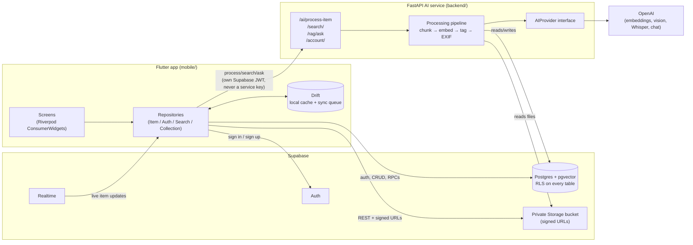

# LifeSearch

[](https://github.com/seraydundar/LifeSearch/actions/workflows/ci.yml)

**Multimodal Personal AI Search Engine.** Save photos, screenshots, PDFs,
notes, voice memos and links from daily life, then find them again with
natural-language, semantic search — *"Google Search, but for your personal
digital life."*

> Status: all 9 planned phases done, plus two passes beyond the
> requirements doc's own scope — first closing 4 gaps found by
> re-reading it (tags, offline keyword search, structured logging, EXIF
> location), then a productization pass (CI/CD, a complete Settings
> screen including Delete Account and biometric/PIN app-lock, a
> grid/sort Library view, and `integration_test` coverage running the
> real app end-to-end on a simulator). 195 tests green across
> backend + mobile. See [`docs/roadmap.md`](docs/roadmap.md) for the
> phase-by-phase detail. Full requirements:
> [`docs/requirements.md`](docs/requirements.md).

## Screenshots

<table>
<tr>
<td></td>
<td></td>
<td></td>
</tr>
<tr>
<td align="center">Home</td>
<td align="center">Library (grid)</td>
<td align="center">Settings</td>
</tr>
</table>

## Architecture



Every mobile write goes to Drift first, then syncs to Supabase in the
background (offline-first — see requirements doc, rule "yazma önce
local'e"). The backend never gets the user's Supabase password or the
`service_role` key from the app; it verifies the caller's own JWT
against `/auth/v1/user` on every request and never touches Storage or
Postgres except as that user. `AIProvider` is an interface, not a
hard dependency on OpenAI — swapping providers doesn't touch the
pipeline.

## Monorepo layout

```
LifeSearch/
├── mobile/    Flutter app (Android/iOS), feature-first architecture
├── backend/   FastAPI AI service (OCR, embeddings, RAG, vector search)
├── infra/     Supabase SQL migrations, deployment config
├── docs/      Requirements, roadmap, architecture notes
└── docker-compose.yml   Local Postgres+pgvector for backend dev
```

## Stack

- **Mobile**: Flutter, Riverpod, go_router, Dio, Drift, freezed
- **Backend**: Python, FastAPI, provider-agnostic `AIProvider` interface
- **Cloud**: Supabase (Auth, Postgres, private Storage, pgvector)

## Getting started

### Mobile

```bash
cd mobile
flutter pub get
flutter run
```

### Backend

```bash
cd backend
python3.12 -m venv .venv
source .venv/bin/activate
pip install -r requirements-dev.txt
cp .env.example .env   # fill in Supabase URL/anon key + an AI provider key
uvicorn app.main:app --reload
```

> macOS/Homebrew note: Homebrew's Python and macOS's system `libexpat`
> disagree on ABI, which breaks anything importing `xml`/`pyexpat` —
> `venv` creation, and later `pypdf` (used for PDF text extraction). Run
> `brew install expat` once, then prefix every backend command —
> `venv` creation, `uvicorn`, `pytest`, `ruff` — with
> `DYLD_LIBRARY_PATH="$(brew --prefix expat)/lib"`.

For AI processing (`POST /ai/process-item`) to actually produce
embeddings, `AI_PROVIDER=openai` and `OPENAI_API_KEY` need to be set in
`backend/.env`. Without a key, the endpoint still responds and the item's
`processing_status` correctly flips to `failed` with a clear
`error_message` on its `processing_jobs` row — it degrades, it doesn't
crash.

For the mobile app to reach a locally-running backend, set
`BACKEND_URL` in `mobile/.env` — `http://127.0.0.1:8000` works from the
iOS Simulator (shares the Mac's network stack); Android emulator needs
`http://10.0.2.2:8000`; a physical device needs the Mac's LAN IP.

### Local Postgres + pgvector (optional, for backend tests)

```bash
docker compose up -d db
```

## Environment variables

Copy `backend/.env.example` to `backend/.env`. Never commit `.env` files —
API keys and the Supabase service role key live only in the backend
environment, never in the Flutter app (see requirements doc, section 36).

## Tests

```bash
# Backend
cd backend && DYLD_LIBRARY_PATH="$(brew --prefix expat)/lib" .venv/bin/pytest
cd backend && DYLD_LIBRARY_PATH="$(brew --prefix expat)/lib" .venv/bin/ruff check .

# Mobile
cd mobile && flutter analyze
cd mobile && flutter test
```

There's also an `integration_test/` suite that runs the real app (real
go_router, real screen wiring, real rendering) on an actual
simulator/device — only the Supabase/backend boundary is faked. It needs
a booted device, so it isn't part of `flutter test` or CI:

```bash
cd mobile && flutter test integration_test/app_test.dart -d <device-id>
```

Every push/PR to `main` runs the same checks in CI — see
[`.github/workflows/ci.yml`](.github/workflows/ci.yml).

## Roadmap

See [`docs/roadmap.md`](docs/roadmap.md) — the project is built in phases,
starting with a backend-less Flutter shell (auth + navigation) and adding
AI capabilities incrementally.
