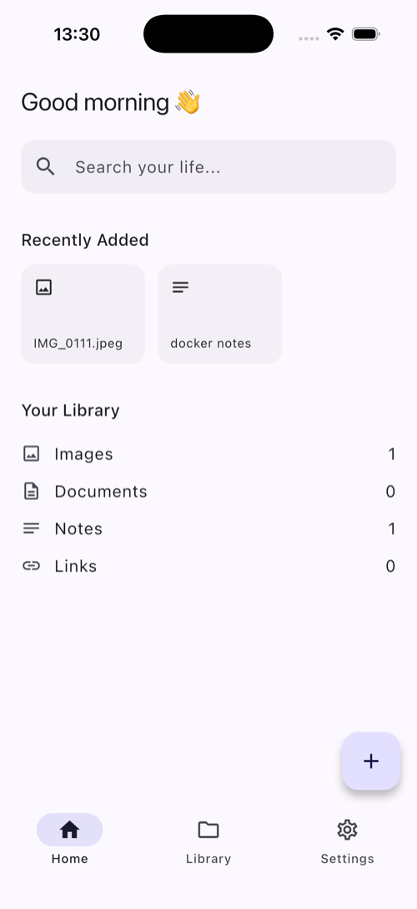
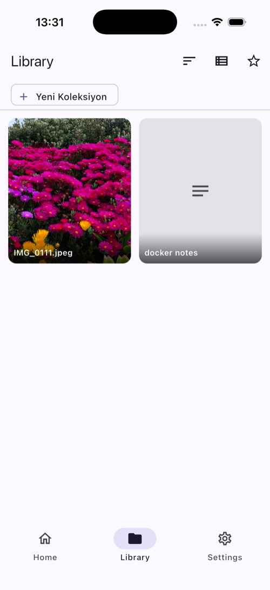
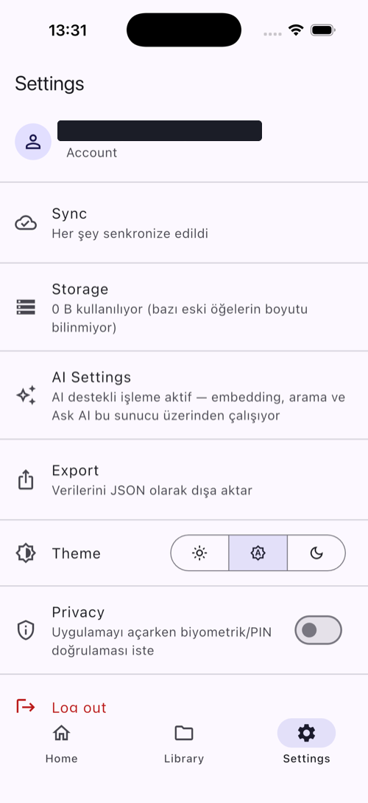
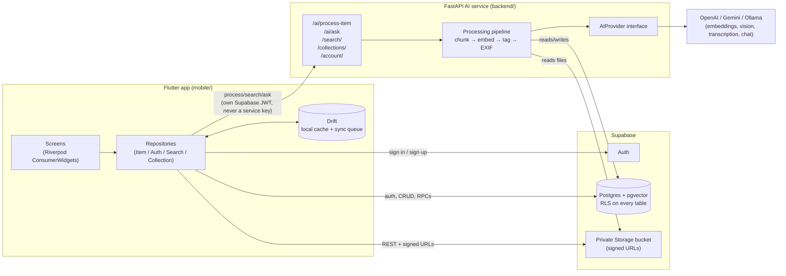

# LifeSearch

[](https://github.com/seraydundar/LifeSearch/actions/workflows/ci.yml)

**Multimodal Personal AI Search Engine.** Save photos, screenshots, PDFs,
notes, voice memos and links from daily life, then find them again with
natural-language, semantic search — *"Google Search, but for your personal
digital life."*

A solo-built, full-stack mobile project: offline-first Flutter client,
FastAPI AI backend, Supabase/pgvector for auth + storage + vector search.
310 mobile + 238 backend tests, built incrementally across 40+ phases
(full history in [`docs/roadmap.md`](docs/roadmap.md)).

**Highlights**
- Hybrid (keyword + vector) semantic search with LLM reranking
- RAG-based "Ask AI" chat, citation-filtered sources, multi-turn context
- Offline-first sync: every write lands in a local Drift cache first,
  then queues to Supabase in the background, with conflict resolution
  and incremental pulls
- Per-item **and** device-level Privacy Mode, biometric-gated
- Pluggable `AIProvider` interface — OpenAI, Gemini, or a fully local
  Ollama pipeline, swappable without touching the processing pipeline
- Duplicate detection, EXIF-based location/capture metadata, OCR
  fallback for scanned PDFs

## Screenshots

<table>
<tr>
<td></td>
<td></td>
<td></td>
</tr>
<tr>
<td align="center">Home</td>
<td align="center">Library (grid)</td>
<td align="center">Settings</td>
</tr>
</table>

## Architecture



Every mobile write lands in Drift first, then syncs to Supabase in the
background — no Realtime channel, a background job's status reaches the
device through `SyncService`'s own pull/poll cycle instead. The backend
never holds the user's password or the `service_role` key; it verifies
the caller's own JWT on every request and acts only as that user.

## Monorepo layout

```
LifeSearch/
├── mobile/    Flutter app (Android/iOS), feature-first architecture
├── backend/   FastAPI AI service (OCR, embeddings, RAG, vector search)
├── infra/     Supabase SQL migrations, deployment config
├── docs/      Requirements, roadmap, architecture notes
└── docker-compose.yml   Local Postgres+pgvector for backend dev
```

## Stack

- **Mobile**: Flutter, Riverpod, go_router, Dio, Drift, freezed
- **Backend**: Python, FastAPI, provider-agnostic `AIProvider` interface
- **Cloud**: Supabase (Auth, Postgres, private Storage, pgvector)

## Getting started

### Mobile

```bash
cd mobile
flutter pub get
flutter run
```

### Backend

```bash
cd backend
python3.12 -m venv .venv
source .venv/bin/activate
pip install -r requirements-dev.txt
cp .env.example .env   # fill in Supabase URL/anon key + an AI provider key
uvicorn app.main:app --reload
```

> **macOS note**: Homebrew's Python and macOS's system `libexpat`
> disagree on ABI. Run `brew install expat` once, then prefix every
> backend command with `DYLD_LIBRARY_PATH="$(brew --prefix expat)/lib"`.

For AI processing to actually produce embeddings, set `AI_PROVIDER`
(`openai` / `gemini` / `local`) and the matching key in `backend/.env`
— without one, items still save, just stay unprocessed. For the mobile
app to reach a local backend, set `BACKEND_URL` in `mobile/.env`
(`http://127.0.0.1:8000` on iOS Simulator, `http://10.0.2.2:8000` on
Android emulator). A local Postgres+pgvector for backend tests:
`docker compose up -d db`.

## Tests

```bash
cd backend && DYLD_LIBRARY_PATH="$(brew --prefix expat)/lib" .venv/bin/pytest
cd mobile && flutter test
```

CI runs the same checks on every push — see
[`.github/workflows/ci.yml`](.github/workflows/ci.yml).
